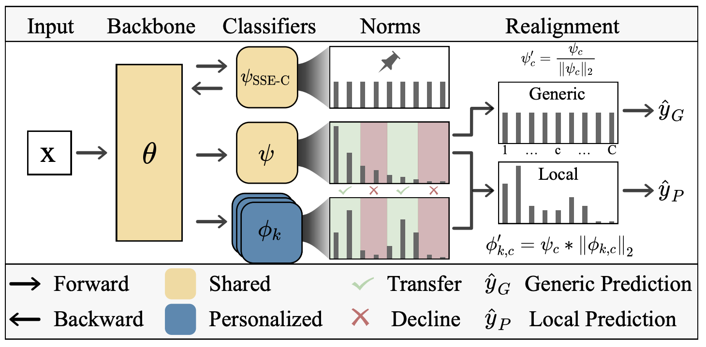

# FedLoGe: Federated Local and Generic Model Training in Fed-LT (ICLR 2024, Official Code)


This repository contains the official source code for ICLR 2024 paper: "Joint Local and Generic Federated Learning under Long-tailed Data." You can access the paper [here](https://openreview.net/pdf?id=V3j5d0GQgH).

**"Federated Local and Generic Model Training in Fed-LT (FedLoGe)"** innovates federated learning by enhancing both local and global model performances in data-imbalanced environments. By merging representation learning with classifier alignment in a neural collapse framework, FedLoGe addresses the traditional challenges of data imbalance and personalization in federated settings. It introduces mechanisms like the Static Sparse Equiangular Tight Frame Classifier (SSE-C) for feature optimization and Global and Local Adaptive Feature Realignment (GLA-FR) for tailored feature alignment, demonstrating superior results on datasets like CIFAR-10/100-LT, ImageNet, and iNaturalist compared to existing methods.




> We also provide implementation for baselines under Fed-LT setup, which can be found in the '**baseline**' folder.

## Usage

To train a universal model (for any data distribution), follow step 1, and infer with:

```python
output = SSE_C(backbone(input))
```
To train a global model specifically for imbalanced data, follow steps 1 and 2, inferring with:
```python
output = realignment_global_head(backbone(input))
```
To train personalized models (work well for imbalanced data, ok of any other data distribution), follow steps 1 and 2, inferring with:
```python
output = realignment_local_heads[k](backbone(input)) + global_head[k](backbone(input))
```

## Core Code

### Step 1: Build SSE-C and train a robust backbone. Maintain a shared global head (g_head) and K personalized local heads (l_heads).


```python
from util.etf_methods import ETF_Classifier
# initialization
backbone = ResNet_xx
SSE_C = nn.Linear(in_features, out_features)
global_head = nn.Linear(in_features, out_features)
local_heads = [nn.Linear(in_features, out_features), ...]
etf = ETF_Classifier(in_features, out_features)
SSE_C.weight.data = sparse_etf_mat.to(args.device)
SSE_C.weight.data = g_head.weight.data.t()

# Training loop for client k
for batch_idx, (images, labels) in enumerate(self.ldr_train):
    # SSE-C train strong backbone
    optimizer_backbone = torch.optim.SGD(list(backbone.parameters()), lr=self.args.lr, momentum=self.args.momentum) # only train backbone, froze the SSE-C
    features = backbone(images)
    output = SSE_C(features)
    loss = nn.CrossEntropyLoss(output, labels)
    loss.backward()
    optimizer_backbone.step()

    # train global head for aggregation
    optimizer_g_head = torch.optim.SGD(list(global_head.parameters()), lr=self.args.lr, momentum=self.args.momentum) # only train backbone, froze the SSE-C
    output_global = global_head(features.detach())
    loss_g = nn.CrossEntropyLoss(output_global, labels)
    loss_g.backward()
    optimizer_g_head.step()

    # train local head, never aggregation
    optimizer_l_head = torch.optim.SGD(list(local_heads[k].parameters()), lr=self.args.lr, momentum=self.args.momentum) # only train backbone, froze the SSE-C
    output_local = local_heads[k](features.detach())
    loss_l = nn.CrossEntropyLoss(output_local, labels)
    loss_l.backward()
    optimizer_l_head.step()
```
Output of step 1: backbone, SSE_C, local_heads, global_head

### Step 2: Personalize feature alignment to get one global model and K personalized models.

#### Step 2.1 Local Adaptive Feature Realignment
Input of step 2.1: global_head, local_heads
```python

realignment_local_heads = copy.deepcopy(local_heads)
norm = torch.norm(realignment_local_heads[k].weight, p=2, dim=1)
realignment_local_heads[k].weight = nn.Parameter(global_head.weight * norm.unsqueeze(1))
zero_classes = np.where(class_distribution == 0)[0]
for i in zero_classes:
    realignment_local_heads.weight.data[i, :] = -1e10
    global_head.weight.data[i, :] = -1e10
```
Output of step 2.1: realignment_local_heads


### Step 2.2 Global Adaptive Feature Realignment
Input of step 2.2: global_head, local_heads
```python
realignment_global_head = copy.deepcopy(global_head)

cali_alpha = torch.norm(realignment_global_head.weight, dim=1)
cali_alpha = torch.pow(cali_alpha, 1)
inverse_cali_alpha = 1.7 / cali_alpha
inverse_cali_alpha = inverse_cali_alpha.view(-1, 1)
realignment_global_head.weight = torch.nn.Parameter(realignment_global_head.weight * inverse_cali_alpha)
```
Output of Step 2.2: realignment_global_head


## Running the  Code

### CIFAR-10/100
Step 1: Training backbone with SSE-C

```python
nohup python fedloge.py --alpha_dirichlet 0.5 --IF 0.01 --beta 0 --gpu 0 --num_users 40 --frac 0.3 > sse_c.log 2>&1 &
```
Step 2: Global and Local feature realignment
```python
python Realignment.py
```

### ImageNet

https://drive.google.com/file/d/1u5XF0AsDm0GRoEp3HJPZ_sSvvWb4BVCv/view?usp=drive_link

### iNaturalist2018

https://drive.google.com/file/d/1HLqF_n1Z8VUCIV3jDHhLmQXFrqs3CacR/view?usp=drive_link


## Citation:

If you find our work useful in your research, please consider citing:

```
@inproceedings{xiaofedloge,
  title={FedLoGe: Joint Local and Generic Federated Learning under Long-tailed Data},
  author={Xiao, Zikai and Chen, Zihan and Liu, Liyinglan and FENG, YANG and Zhou, Joey Tianyi and Wu, Jian and Liu, Wanlu and Yang, Howard Hao and Liu, Zuozhu},
  booktitle={The Twelfth International Conference on Learning Representations}
}
```

